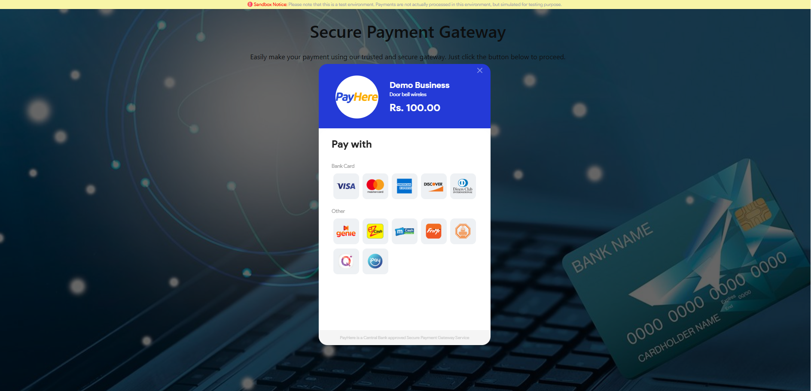

# Simple Sandbox Payment Gateway Integration

This project demonstrates a simple integration of a sandbox payment gateway using PHP. It allows users to make test transactions using sandbox test cards.

## Screenshots

### Home Page

### Payment Gateway

## Features
- Simple and user-friendly interface
- Secure transaction processing with sandbox test credentials
- Supports basic payment flow: amount entry, card details input, and payment processing
- Uses a sandbox environment for testing without real transactions

## Installation and Setup

### Prerequisites
- PHP (>=7.4)
- Apache server (XAMPP, WAMP, or any local server)
- Composer (if required by any dependencies)

### Steps to Run Locally
1. Download this repository

Start your local server (Apache via XAMPP, WAMP, etc.).

Place the project folder in your server's root directory (e.g., htdocs for XAMPP).

Configure the sandbox API keys in config.php:

define('PAYMENT_GATEWAY_API_KEY', 'your_sandbox_api_key_here');
define('PAYMENT_GATEWAY_SECRET', 'your_sandbox_secret_here');

How to Test a Payment in Sandbox Mode
You can use the following test card numbers to simulate successful and failed payments.

✅ Successful Payment Test Cards
Use any valid name, CVV, and future expiration date.

Visa: 4916 2175 0161 1292

MasterCard: 5307 7321 2553 1191

AMEX: 3467 8100 5510 225

📌 Note: Any card other than the ones listed above will result in a failed payment.

Technologies Used
Backend: PHP

Frontend: HTML, CSS, JavaScript

Database: MySQL (if needed)

Payment Processing: Sandbox Payment Gateway API
